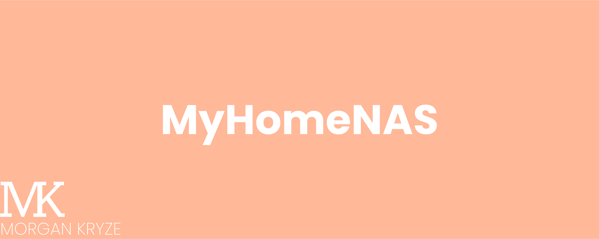

## Overview

> MyHomeNAS provides you builds and guides to create your home (own) NAS using a Single Board Computer and OpenMediaVault.

The goal of this project is to provide a "template" for you to get inspiration and build your own secure and reliable NAS config to store your data and to access it from anywhere and deploy useful homelab services. The configuration allow modularity for future improvements, scalability and different budgets.

> [!IMPORTANT]
> The authors of this project are not responsible for any data loss, hardware failure or security breach. You are the only responsible for your data and your network. See this project as suggestions and should be adapted to your needs and your knowledge.

## Project

The documentation is for now composed of markdown files in the `docs` folder. The goal is to provide a complete guide to setup your NAS from the hardware to the software. 

Start with the -> [`index`](./docs/index.md) <- to discover everything!

## Supported languages

- Only English is supported for now. The project may be translated in the future if the interest is there.

## Contributing

If you want to contribute to the project, you can follow the steps described in the [CONTRIBUTING](./.github/CONTRIBUTING.md) file or [open an issue](https://github.com/MorganKryze/MyHomeNAS/issues) to discuss your ideas.

## License

This project is licensed under the GNU GPL v3, which allows you to _use_, _modify_, and _distribute_ the software freely, as long as you **provide the source code** and do not add restrictions that limit others' rights under the same license. For full details, refer to the [LICENSE](LICENSE) file.
