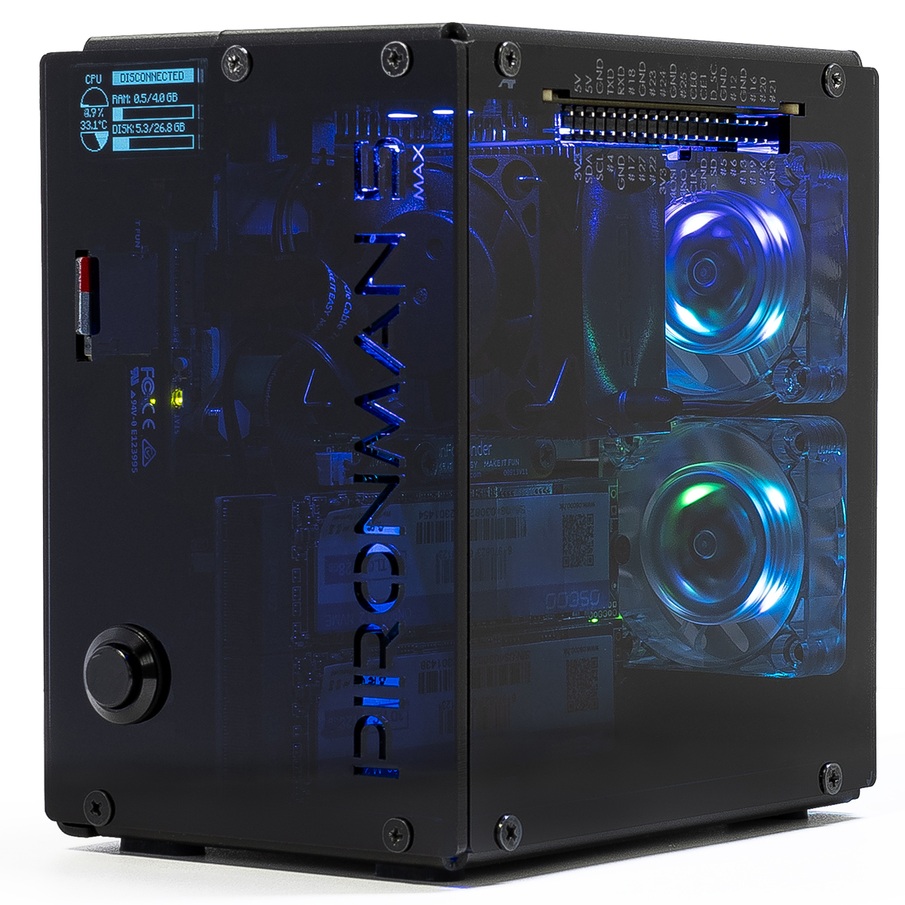
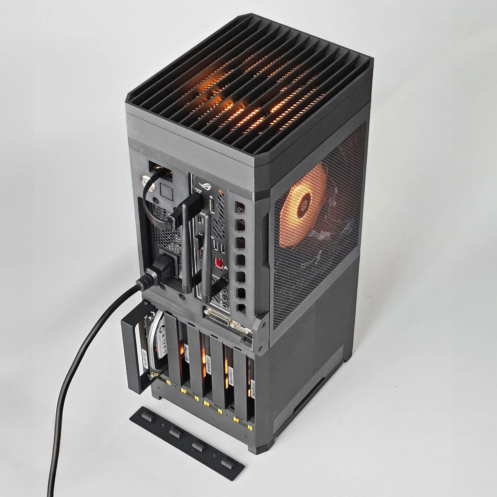
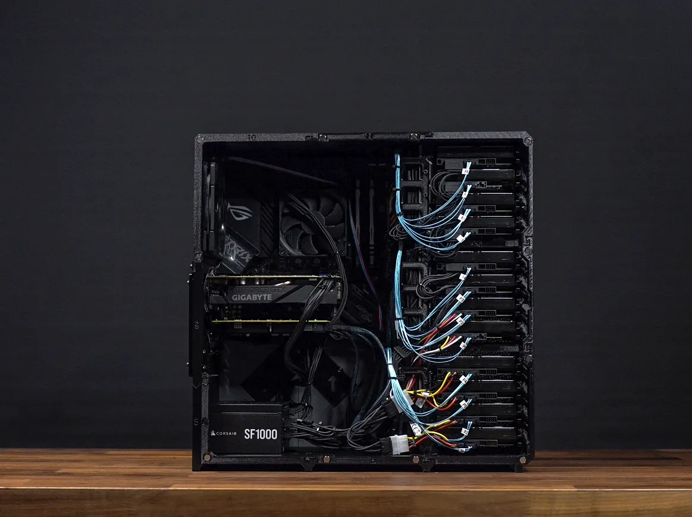

## Overview

Welcome to My Home NAS (MHN), a comprehensive guide to building your own Network Attached Storage (NAS) right at home. Whether you're a beginner looking to dip your toes into the world of home servers or an experienced enthusiast aiming to optimize your storage solutions, this guide may have something for you.

Building a NAS that gives you control over your data, enhances your privacy, and provides a centralized location for all your files is an empowering experience and should not be a hassle. We will try to bring you a way for each budget and headache tolerance.

We will break down a few builds, and explain the components choices behind them. Feel free to adapt them according to your needs and budget and experience level.

> [!IMPORTANT]
> The authors of this project will not be held responsible for any data loss, hardware failure or security breach. You are the only responsible for your data and your network. See this project as suggestions and should be adapted to your needs and your knowledge.

## Let's explore the builds

### Level 1: Raspberry Pi 5 + 2 SSD (aka "la débrouille")

| Compute base      | Price | Power Consumption | Difficulty | Use case                                                                    |
| ----------------- | ----- | ----------------- | ---------- | --------------------------------------------------------------------------- |
| Low: Raspberry Pi | ~300€ | 15-20W            | Beginner   | Personal cloud storage, media server, backup server, low storage, low power |

This build is perfect for beginners who want to explore the world of NAS and homeserver without breaking the bank. The Raspberry Pi 5 is a powerful SBC that can handle basic NAS tasks with ease. With 2 SSDs, you can set up a mirror configuration for data redundancy and feel safe about your data.

[🛠️ Start building!](./docs/parts/builds/rpi/index.md)

### Level 2: ITX motherboard + 4-5 HDD (aka "le juste milieu")

| Compute base       | Price | Power Consumption | Difficulty   | Use case                                                                                     |
| ------------------ | ----- | ----------------- | ------------ | -------------------------------------------------------------------------------------------- |
| Medium: ITX Mother | ~800€ | 50-60W            | Intermediate | Home media server, file sharing, backup server, moderate/high storage, low power consumption |

This build is ideal for those who want a more robust NAS setup with increased storage capacity and performance. An ITX motherboard with integrated CPU will provide the necessary power to handle multiple users and services without increasing power consumption too much. With 4 HDDs, you can set up RAID configurations for data redundancy and performance.

[🛠️ Start building!](./docs/parts/builds/itx/index.md)

### Level 3: Full tower + 12 HDD (aka "le monstre")

| Compute base                   | Price  | Power Consumption | Difficulty | Use case                                                                                                               |
| ------------------------------ | ------ | ----------------- | ---------- | ---------------------------------------------------------------------------------------------------------------------- |
| High: Full Tower with atx mobo | ~2000€ | 180-400W          | Advanced   | Enterprise-grade storage, virtualization, high availability, large-scale media server, high/very high storage capacity |

This build is for advanced users who require strong cloud independence and massive storage capacity. A full tower case allows for multiple HDDs and better cooling solutions, making it suitable for enterprise-grade storage solutions. With 12 HDDs, you can implement advanced RAID configurations for maximum data redundancy and performance. The additionnal capabilities (services, virtual machines, etc.) will require a more powerful CPU and maybe some GPU, implying a higher power consumption.

[🛠️ Start building!](./docs/parts/builds/atx/index.md)

## Contributing

If you want to contribute to the project, you can follow the steps described in the [CONTRIBUTING](./.github/CONTRIBUTING.md) file or [open an issue](https://github.com/MorganKryze/MyHomeNAS/issues) to discuss your ideas.

## License

This project is licensed under the GNU GPL v3, which allows you to _use_, _modify_, and _distribute_ the software freely, as long as you **provide the source code** and do not add restrictions that limit others' rights under the same license. For full details, refer to the [LICENSE](LICENSE) file.
