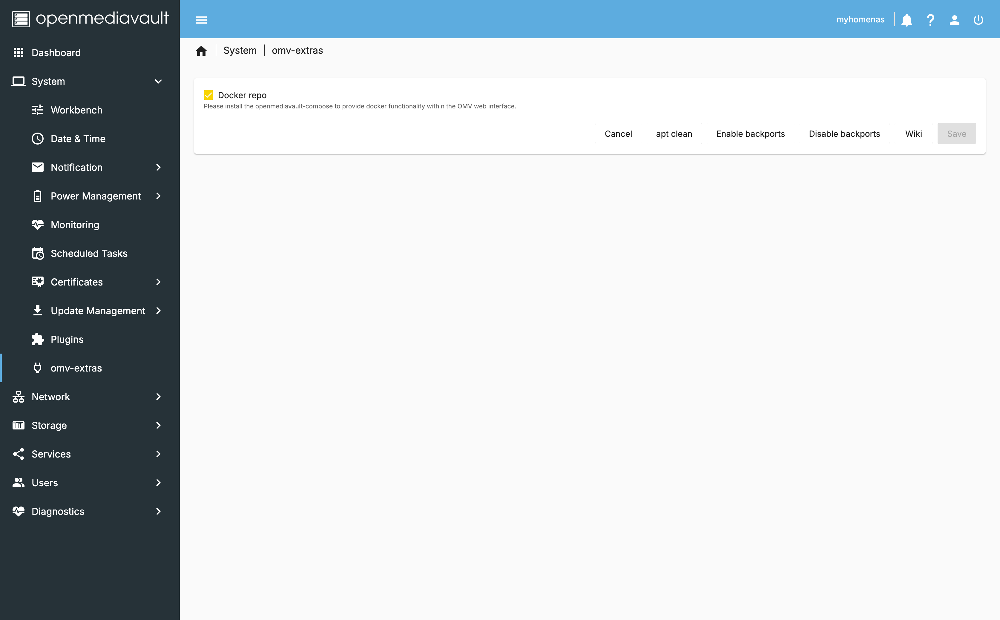
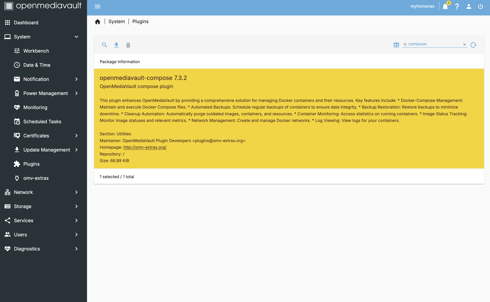
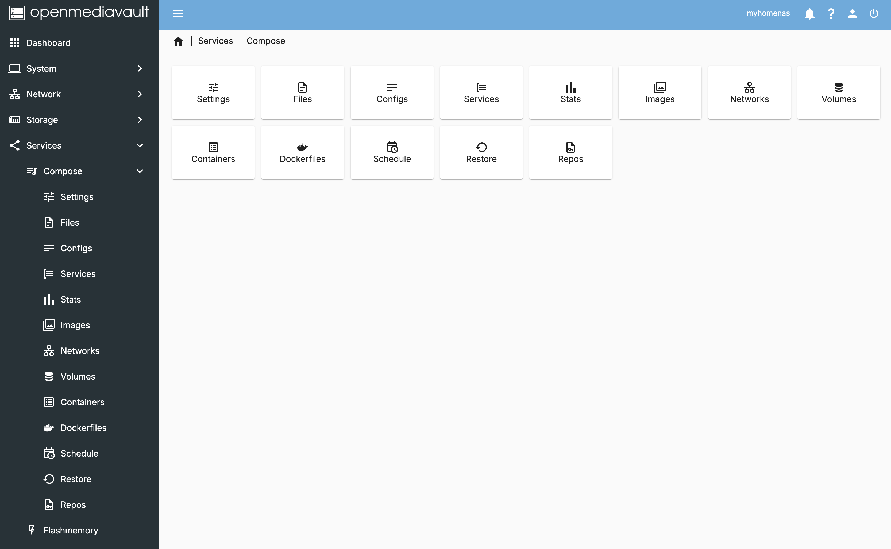
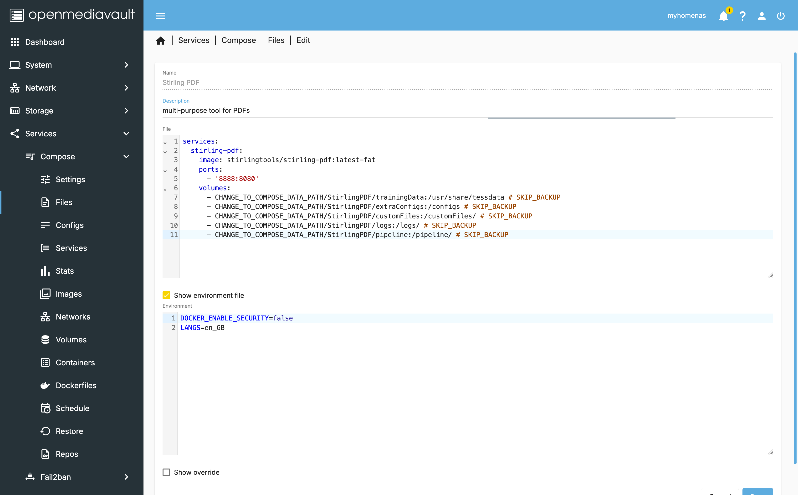

# Docker and Cloudflare tunnels

> This section will teach you how to install and configure Docker on OpenMediaVault. It will also cover the installation of some useful containers.

- **Want to go back to the index page?** [click here](../index.md).

## Table of Contents

- [Docker and Cloudflare tunnels](#docker-and-cloudflare-tunnels)
  - [Table of Contents](#table-of-contents)
  - [I - Install docker](#i---install-docker)
  - [II - Some useful containers](#ii---some-useful-containers)
  - [III - Exposing your services to the web](#iii---exposing-your-services-to-the-web)
  - [IV - Adding Security layers](#iv---adding-security-layers)
  - [Conclusion](#conclusion)
  - [Sources](#sources)

## I - Install docker

> The tool we will need will be docker composer to be precise. A declarative way to define and run multi-container Docker applications. Some examples will be given to you later on.

- Then, go to the `omv-extras` tab and enable `Docker repo`.



- Go to the `System` tab and click on `Plugins` in the left sidebar and look for `openmediavault-compose` and click on install.



- Once installed, a new category should have been created in the `Services` tab and click on `Compose` in the left sidebar.



- Under the `Settings` tab, assign these variables:
  - `Compose Files`:
    - `Shared folder`: `containers_config`
    - `Owner`: `sysadmin`
    - `Group`: `sysadmin`
    - `Permissions`: `Administrator - read/write, Users - read/write, Others - no access`
  - `Data`:
    - `Shared folder`: `containers_data`
  - `Backup`:
    - `Shared folder`: `containers_backup`
    - `Max Size`: `0` (unlimited)


## II - Some useful containers

> Here are some examples of containers you can install using docker-compose to get you started. You can find more on the [Linuxserver fleet](https://fleet.linuxserver.io/).

- [Stirling pdf](https://www.stirlingpdf.com/): a large pdf tool to convert, merge, split, and compress pdf files.

File: (mind to change the paths to your own)

```yaml
services:
  stirling-pdf:
    image: stirlingtools/stirling-pdf:latest-fat
    ports:
      - '8888:8080'
    volumes:
      - CHANGE_TO_COMPOSE_DATA_PATH/StirlingPDF/trainingData:/usr/share/tessdata # SKIP_BACKUP
      - CHANGE_TO_COMPOSE_DATA_PATH/StirlingPDF/extraConfigs:/configs # SKIP_BACKUP
      - CHANGE_TO_COMPOSE_DATA_PATH/StirlingPDF/customFiles:/customFiles/ # SKIP_BACKUP
      - CHANGE_TO_COMPOSE_DATA_PATH/StirlingPDF/logs:/logs/ # SKIP_BACKUP
      - CHANGE_TO_COMPOSE_DATA_PATH/StirlingPDF/pipeline:/pipeline/ # SKIP_BACKUP
```

Environment:

```plaintext
DOCKER_ENABLE_SECURITY=false
LANGS=en_GB
```



And try to connect to the container by going to `http://your-ip:8888`.

- Get the full list of my containers [here](./containers.md).

## III - Exposing your services to the web

> We will use Cloudflare tunnels to expose our services to the web. This will allow us to access our services from anywhere in the world. You will need to have a domain name and a Cloudflare account.

- Assuming that you have a domain name and a Cloudflare account, go to the `Network` tab and click on `Tunnels` in the left sidebar.
- Then `Create a new tunnel` and fill in the form with the following information:

  - `Type`: `Cloudflared`
  - `Name`: `NAS-RPI`

- When prompted to install a connector, select `Docker` and copy the command. Then extract the token in your clipboard.
- Go back to the `Compose` tab and create a new file:

File:

```yaml
services:
  cloudflared:
    image: cloudflare/cloudflared:latest
    restart: unless-stopped
    command: tunnel --no-autoupdate run
```

Environment: (mind to change the token)

```plaintext
TUNNEL_TOKEN=...
```

- Save, and UP the container. You should see the tunnel running in the `Tunnels` tab.

## IV - Adding Security layers

## Conclusion

Thank you for following these guides. I hope you found them useful. If you have any questions or suggestions, feel free to reach out to me or [open an issue](https://github.com/MorganKryze/MyHomeNAS/issues) on the GitHub repository.

## Sources

- [Wiki of the compose plugin](https://wiki.omv-extras.org/doku.php?id=omv6:omv6_plugins:docker_compose) from the [omv-extras](https://wiki.omv-extras.org/doku.php?id=start) documentation
- [Umbrel OS app store](https://apps.umbrel.com/category/all) gave me some ideas for the containers to install.

---

Last update: Jan. 2025
Created: Jan. 2025
