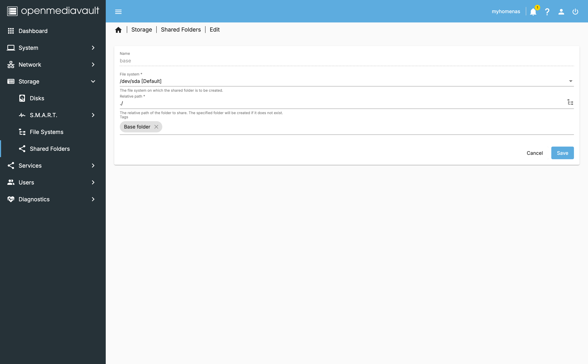

# Docker and Cloudflare tunnels

> This section will teach you how to install and configure Docker on OpenMediaVault. It will also cover the installation of some useful containers.

- **Want to go back to the index page?** [click here](../index.md).

## Table of Contents

- [Docker and Cloudflare tunnels](#docker-and-cloudflare-tunnels)
  - [Table of Contents](#table-of-contents)
  - [I - Install docker](#i---install-docker)
  - [II - Some useful containers](#ii---some-useful-containers)
  - [III - Exposing your services to the web](#iii---exposing-your-services-to-the-web)
  - [IV - Adding a security layer](#iv---adding-a-security-layer)
    - [Install Wazuh](#install-wazuh)
    - [Changing passwords](#changing-passwords)
  - [Conclusion](#conclusion)
  - [Sources](#sources)

## I - Install docker

> The tool we will need will be docker composer to be precise. A declarative way to define and run multi-container Docker applications. Some examples will be given to you later on.

- Then, go to the `omv-extras` tab and enable `Docker repo`.


- Go to the `System` tab and click on `Plugins` in the left sidebar and look for `openmediavault-compose` and click on install.


- Once installed, a new category should have been created in the `Services` tab and click on `Compose` in the left sidebar.


- Under the `Settings` tab, assign these variables:
  - `Compose Files`:
    - `Shared folder`: `containers_config`
    - `Owner`: `sysadmin`
    - `Group`: `sysadmin`
    - `Permissions`: `Administrator - read/write, Users - read/write, Others - no access`
  - `Data`:
    - `Shared folder`: `containers_data`
  - `Backup`:
    - `Shared folder`: `containers_backup`
    - `Max Size`: `0` (unlimited)


## II - Some useful containers

> Here are some examples of containers you can install using docker-compose to get you started. You can find more on the [Linuxserver fleet](https://fleet.linuxserver.io/).

- [Stirling pdf](https://www.stirlingpdf.com/): a large pdf tool to convert, merge, split, and compress pdf files.

> [!WARNING]
> The following file is a template, you will need to change the paths to your own. The paths are based on the shared folders you created earlier (e.g. change `CHANGE_TO_COMPOSE_DATA_PATH` to something like `/srv/dev-disk-by-label-Data/`).

```yaml
services:
  stirling-pdf:
    image: stirlingtools/stirling-pdf:latest-fat
    container_name: stirling-pdf
    restart: unless-stopped
    ports:
      - '8888:8080'
    volumes:
      - CHANGE_TO_COMPOSE_DATA_PATH/StirlingPDF/trainingData:/usr/share/tessdata # SKIP_BACKUP
      - CHANGE_TO_COMPOSE_DATA_PATH/StirlingPDF/extraConfigs:/configs # SKIP_BACKUP
      - CHANGE_TO_COMPOSE_DATA_PATH/StirlingPDF/customFiles:/customFiles/ # SKIP_BACKUP
      - CHANGE_TO_COMPOSE_DATA_PATH/StirlingPDF/logs:/logs/ # SKIP_BACKUP
      - CHANGE_TO_COMPOSE_DATA_PATH/StirlingPDF/pipeline:/pipeline/ # SKIP_BACKUP
    environment:
      - DOCKER_ENABLE_SECURITY=false # Necessary to download
      - LANGS=en_GB
```


And try to connect to the container by going to `http://your-ip:8888`.

- FileBrowser - [FileBrowser](https://filebrowser.org/): a file manager for the web.

> [!WARNING]
> Same as before, you will need to change the paths to your own. However, note that `CHANGE_TO_BASE_PATH` will be the base path you want filebrowser to access. I created a shared folder called `base` for this purpose.

```yaml
services:
  filebrowser:
    image: filebrowser/filebrowser:latest
    container_name: filebrowser
    restart: unless-stopped
    ports:
      - '3670:80'
    volumes:
      - CHANGE_TO_BASE_PATH:/srv # SKIP_BACKUP
      - CHANGE_TO_COMPOSE_DATA_PATH/FileBrowser/filebrowser.db:/database/filebrowser.db # SKIP_BACKUP
      - CHANGE_TO_COMPOSE_DATA_PATH/FileBrowser/settings.json:/config/settings.json # BACKUP
    environment:
      - PUID=$(id -u)
      - PGID=$(id -g)
```



- Once laucnhed, you can access the filebrowser by going to `http://your-ip:3670`.

> [!IMPORTANT]
> Right after logging in with `admin` and `admin`, I strongly recommend **changing the password**. Go to `Settings` and then `User Management` and click on the `admin` user to change the password.

- Get the list of my containers [here](./containers.md).

## III - Exposing your services to the web

> We will use Cloudflare tunnels to expose our services to the web. This will allow us to access our services from anywhere in the world. You will need to have a domain name and a Cloudflare account.

- Assuming that you have a domain name and a Cloudflare account, go to the `Network` tab and click on `Tunnels` in the left sidebar.
- Then `Create a new tunnel` and fill in the form with the following information:

  - `Type`: `Cloudflared`
  - `Name`: `NAS-RPI`

- When prompted to install a connector, select `Docker` and copy the command. Then extract the token in your clipboard.
- Go back to the `Compose` tab and create a new file:

File: (mind to change the token)

```yaml
services:
  cloudflared:
    image: cloudflare/cloudflared:latest
    container_name: cloudflare-tunnel
    restart: unless-stopped
    command: tunnel --no-autoupdate run
    environment:
      - TUNNEL_TOKEN=...
```

- Save, and UP the container. You should see the tunnel running in the `Tunnels` tab.
- Now, click on the `Public Hostname` panel and click on `Add a public hostname`. Fill in the form with the following information:

  - `Subdomain`: `pdf` or `files` for example
  - `Domain`: `your-domain.com`
  - `Type`: `HTTP` (For self-signed certificates, go to `TLS` and toggle `No TLS verification`)
  - `URL`: `your-ip:8888` or `your-ip:3670`

- Once done, you should be able to access your services by going to `http://subdomain.your-domain.com`.

---

This section is to be ignored as Wazuh is only available for x86 architecture (indexer and dash board, manager and agent are available for ARM architecture).

Refs:

- <https://github.com/wazuh/wazuh-docker/issues/1306>
- <https://github.com/wazuh/wazuh-docker/issues/924>

## IV - Adding a security layer

> Wazuh is an open-source security monitoring platform that can be used to monitor your containers and your NAS and your devices.

### Install Wazuh

> We will generate the certificates for the Wazuh manager and then install the manager, the indexer, and the dashboard.

- First we need to change the value of the variable `max_map_count` in the file `/etc/sysctl.conf` to `262144`.

```bash
ssh myhomenas
```

```bash
echo "vm.max_map_count=262144" >> /etc/sysctl.conf
sysctl -p
```

- Download the [`wazuh-docker` repository](https://github.com/wazuh/wazuh-docker/tree/master).

```bash
git clone https://github.com/wazuh/wazuh-docker.git -b v4.10.1
```

- Then edit the file `generate-indexer-certs.yml`:

```bash
nano wazuh-docker/single-node/generate-indexer-certs.yml
```

- And replace with the following content after changing the paths to your own (you start to get the idea):

```yml
# Wazuh App Copyright (C) 2017 Wazuh Inc. (License GPLv2)
services:
  generator:
    image: wazuh/wazuh-certs-generator:0.0.2
    hostname: wazuh-certs-generator
    volumes:
      - CHANGE_TO_COMPOSE_DATA_PATH/Wazuh/config/wazuh_indexer_ssl_certs/:/certificates/
      - CHANGE_TO_COMPOSE_DATA_PATH/Wazuh/config/certs.yml:/config/certs.yml
```

- Then move to the folder and execute:

```bash
cd wazuh-docker/single-node/
sudo docker compose -f generate-indexer-certs.yml run --rm generator
```

- Once done, proceed to the OMV interface and create a new file in the `Compose` tab:

> [!WARNING]
> Before using this file, check the latest verion of the software at the [official documentation](https://documentation.wazuh.com/current/deployment-options/docker/index.html).
> Once, the version is up-to-date, you may check what I changed from the default yaml configuration file:
>
> - Removed the `version` tag as it is deprecated.
> - Updated the `restart` tag to `unless-stopped`.
> - Updated the `port` for HTTPS to `9100` for the `dashboard` service (`443` is already used by OMV).
> - Finally, all volumes are mapped using the base `CHANGE_TO_COMPOSE_DATA_PATH/Wazuh/` path. Make sure to change it to your own path (e.g. `/srv/dev-disk-by-label-Data/Wazuh`).

```yml
# Wazuh App Copyright (C) 2017, Wazuh Inc. (License GPLv2)
services:
  wazuh.manager:
    image: wazuh/wazuh-manager:5.0.0
    hostname: wazuh.manager
    restart: unless-stopped
    ulimits:
      memlock:
        soft: -1
        hard: -1
      nofile:
        soft: 655360
        hard: 655360
    ports:
      - '1514:1514'
      - '1515:1515'
      - '514:514/udp'
      - '55000:55000'
    environment:
      INDEXER_URL: https://wazuh.indexer:9200
      INDEXER_USERNAME: admin
      INDEXER_PASSWORD: admin
      FILEBEAT_SSL_VERIFICATION_MODE: full
      SSL_CERTIFICATE_AUTHORITIES: /etc/ssl/root-ca.pem
      SSL_CERTIFICATE: /etc/ssl/filebeat.pem
      SSL_KEY: /etc/ssl/filebeat.key
      API_USERNAME: wazuh-wui
      API_PASSWORD: MyS3cr37P450r.*-
    volumes:
      - CHANGE_TO_COMPOSE_DATA_PATH/Wazuh/wazuh_api_configuration:/var/ossec/api/configuration
      - CHANGE_TO_COMPOSE_DATA_PATH/Wazuh/wazuh_etc:/var/ossec/etc
      - CHANGE_TO_COMPOSE_DATA_PATH/Wazuh/wazuh_logs:/var/ossec/logs
      - CHANGE_TO_COMPOSE_DATA_PATH/Wazuh/wazuh_queue:/var/ossec/queue
      - CHANGE_TO_COMPOSE_DATA_PATH/Wazuh/wazuh_var_multigroups:/var/ossec/var/multigroups
      - CHANGE_TO_COMPOSE_DATA_PATH/Wazuh/wazuh_integrations:/var/ossec/integrations
      - CHANGE_TO_COMPOSE_DATA_PATH/Wazuh/wazuh_active_response:/var/ossec/active-response/bin
      - CHANGE_TO_COMPOSE_DATA_PATH/Wazuh/wazuh_agentless:/var/ossec/agentless
      - CHANGE_TO_COMPOSE_DATA_PATH/Wazuh/wazuh_wodles:/var/ossec/wodles
      - CHANGE_TO_COMPOSE_DATA_PATH/Wazuh/filebeat_etc:/etc/filebeat
      - CHANGE_TO_COMPOSE_DATA_PATH/Wazuh/filebeat_var:/var/lib/filebeat
      - CHANGE_TO_COMPOSE_DATA_PATH/Wazuh/config/wazuh_indexer_ssl_certs/root-ca-manager.pem:/etc/ssl/root-ca.pem
      - CHANGE_TO_COMPOSE_DATA_PATH/Wazuh/config/wazuh_indexer_ssl_certs/wazuh.manager.pem:/etc/ssl/filebeat.pem
      - CHANGE_TO_COMPOSE_DATA_PATH/Wazuh/config/wazuh_indexer_ssl_certs/wazuh.manager-key.pem:/etc/ssl/filebeat.key
      - CHANGE_TO_COMPOSE_DATA_PATH/Wazuh/config/wazuh_cluster/wazuh_manager.conf:/wazuh-config-mount/etc/ossec.conf

  wazuh.indexer:
    image: wazuh/wazuh-indexer:5.0.0
    hostname: wazuh.indexer
    restart: unless-stopped
    ulimits:
      memlock:
        soft: -1
        hard: -1
      nofile:
        soft: 65536
        hard: 65536
    ports:
      - '9200:9200'
    environment:
      OPENSEARCH_JAVA_OPTS: '-Xms1g -Xmx1g'
      bootstrap.memory_lock: 'true'
      NODE_NAME: 'wazuh.indexer'
      CLUSTER_INITIAL_MASTER_NODES: 'wazuh.indexer'
      CLUSTER_NAME: 'wazuh-cluster'
      PATH_DATA: /var/lib/wazuh-indexer
      PATH_LOGS: /var/log/wazuh-indexer
      HTTP_PORT: 9200-9299
      TRANSPORT_TCP_PORT: 9300-9399
      COMPATIBILITY_OVERRIDE_MAIN_RESPONSE_VERSION: 'true'
      PLUGINS_SECURITY_SSL_HTTP_PEMCERT_FILEPATH: /usr/share/wazuh-indexer/certs/wazuh.indexer.pem
      PLUGINS_SECURITY_SSL_HTTP_PEMKEY_FILEPATH: /usr/share/wazuh-indexer/certs/wazuh.indexer.key
      PLUGINS_SECURITY_SSL_HTTP_PEMTRUSTEDCAS_FILEPATH: /usr/share/wazuh-indexer/certs/root-ca.pem
      PLUGINS_SECURITY_SSL_TRANSPORT_PEMCERT_FILEPATH: /usr/share/wazuh-indexer/certs/wazuh.indexer.pem
      PLUGINS_SECURITY_SSL_TRANSPORT_PEMKEY_FILEPATH: /usr/share/wazuh-indexer/certs/wazuh.indexer.key
      PLUGINS_SECURITY_SSL_TRANSPORT_PEMTRUSTEDCAS_FILEPATH: /usr/share/wazuh-indexer/certs/root-ca.pem
      PLUGINS_SECURITY_SSL_HTTP_ENABLED: 'true'
      PLUGINS_SECURITY_SSL_TRANSPORT_ENFORCE_HOSTNAME_VERIFICATION: 'false'
      PLUGINS_SECURITY_SSL_TRANSPORT_RESOLVE_HOSTNAME: 'false'
      PLUGINS_SECURITY_AUTHCZ_ADMIN_DN: 'CN=admin,OU=Wazuh,O=Wazuh,L=California,C=US'
      PLUGINS_SECURITY_CHECK_SNAPSHOT_RESTORE_WRITE_PRIVILEGES: 'true'
      PLUGINS_SECURITY_ENABLE_SNAPSHOT_RESTORE_PRIVILEGE: 'true'
      PLUGINS_SECURITY_NODES_DN: 'CN=wazuh.indexer,OU=Wazuh,O=Wazuh,L=California,C=US'
      PLUGINS_SECURITY_RESTAPI_ROLES_ENABLED: '["all_access", "security_rest_api_access"]'
      PLUGINS_SECURITY_SYSTEM_INDICES_ENABLED: 'true'
      PLUGINS_SECURITY_SYSTEM_INDICES_INDICES: '[".opendistro-alerting-config", ".opendistro-alerting-alert*", ".opendistro-anomaly-results*", ".opendistro-anomaly-detector*", ".opendistro-anomaly-checkpoints", ".opendistro-anomaly-detection-state", ".opendistro-reports-*", ".opendistro-notifications-*", ".opendistro-notebooks", ".opensearch-observability", ".opendistro-asynchronous-search-response*", ".replication-metadata-store"]'
      PLUGINS_SECURITY_ALLOW_DEFAULT_INIT_SECURITYINDEX: 'true'
      CLUSTER_ROUTING_ALLOCATION_DISK_THRESHOLD_ENABLED: 'false'
    volumes:
      - CHANGE_TO_COMPOSE_DATA_PATH/Wazuh/wazuh-indexer-data:/var/lib/wazuh-indexer
      - CHANGE_TO_COMPOSE_DATA_PATH/Wazuh/config/wazuh_indexer_ssl_certs/root-ca.pem:/usr/share/wazuh-indexer/certs/root-ca.pem
      - CHANGE_TO_COMPOSE_DATA_PATH/Wazuh/config/wazuh_indexer_ssl_certs/wazuh.indexer-key.pem:/usr/share/wazuh-indexer/certs/wazuh.indexer.key
      - CHANGE_TO_COMPOSE_DATA_PATH/Wazuh/config/wazuh_indexer_ssl_certs/wazuh.indexer.pem:/usr/share/wazuh-indexer/certs/wazuh.indexer.pem
      - CHANGE_TO_COMPOSE_DATA_PATH/Wazuh/config/wazuh_indexer_ssl_certs/admin.pem:/usr/share/wazuh-indexer/certs/admin.pem
      - CHANGE_TO_COMPOSE_DATA_PATH/Wazuh/config/wazuh_indexer_ssl_certs/admin-key.pem:/usr/share/wazuh-indexer/certs/admin-key.pem
      #  if you need mount a custom opensearch.yml, uncomment the next line and delete the environment variables
      # - CHANGE_TO_COMPOSE_DATA_PATH/Wazuh/config/wazuh_indexer/wazuh.indexer.yml:/usr/share/wazuh-indexer/opensearch.yml

  wazuh.dashboard:
    image: wazuh/wazuh-dashboard:5.0.0
    hostname: wazuh.dashboard
    restart: unless-stopped
    ulimits:
      memlock:
        soft: -1
        hard: -1
      nofile:
        soft: 65536
        hard: 65536
    ports:
      - 9100:5601
    environment:
      WAZUH_API_URL: https://wazuh.manager
      DASHBOARD_USERNAME: kibanaserver
      DASHBOARD_PASSWORD: kibanaserver
      API_USERNAME: wazuh-wui
      API_PASSWORD: MyS3cr37P450r.*-
      SERVER_HOST: 0.0.0.0
      SERVER_PORT: 5601
      OPENSEARCH_HOSTS: https://wazuh.indexer:9200
      OPENSEARCH_SSL_VERIFICATIONMODE: certificate
      OPENSEARCH_REQUESTHEADERSALLOWLIST: '["securitytenant","Authorization"]'
      OPENSEARCH_SECURITY_MULTITENANCY_ENABLED: 'false'
      SERVER_SSL_ENABLED: 'true'
      OPENSEARCH_SECURITY_READONLY_MODE_ROLES: '["kibana_read_only"]'
      SERVER_SSL_KEY: '/usr/share/wazuh-dashboard/certs/wazuh-dashboard-key.pem'
      SERVER_SSL_CERTIFICATE: '/usr/share/wazuh-dashboard/certs/wazuh-dashboard.pem'
      OPENSEARCH_SSL_CERTIFICATEAUTHORITIES: '["/usr/share/wazuh-dashboard/certs/root-ca.pem"]'
      UISETTINGS_OVERRIDES_DEFAULTROUTE: /app/wz-home
    volumes:
      - CHANGE_TO_COMPOSE_DATA_PATH/Wazuh/wazuh-dashboard-config:/usr/share/wazuh-dashboard/data/wazuh/config
      - CHANGE_TO_COMPOSE_DATA_PATH/Wazuh/wazuh-dashboard-custom:/usr/share/wazuh-dashboard/plugins/wazuh/public/assets/custom
      - CHANGE_TO_COMPOSE_DATA_PATH/Wazuh/config/wazuh_indexer_ssl_certs/wazuh.dashboard.pem:/usr/share/wazuh-dashboard/certs/wazuh-dashboard.pem
      - CHANGE_TO_COMPOSE_DATA_PATH/Wazuh/config/wazuh_indexer_ssl_certs/wazuh.dashboard-key.pem:/usr/share/wazuh-dashboard/certs/wazuh-dashboard-key.pem
      - CHANGE_TO_COMPOSE_DATA_PATH/Wazuh/config/wazuh_indexer_ssl_certs/root-ca.pem:/usr/share/wazuh-dashboard/certs/root-ca.pem
      - CHANGE_TO_COMPOSE_DATA_PATH/Wazuh/config/wazuh_dashboard/wazuh.yml:/wazuh-config-mount/data/wazuh/config/wazuh.yml
      #  if you need mount a custom opensearch-dashboards.yml, uncomment the next line and delete the environment variables
      # - CHANGE_TO_COMPOSE_DATA_PATH/Wazuh/config/wazuh_dashboard/opensearch_dashboards.yml:/wazuh-config-mount/config/opensearch_dashboards.yml
    depends_on:
      - wazuh.indexer
    links:
      - wazuh.indexer:wazuh.indexer
      - wazuh.manager:wazuh.manager

volumes:
  wazuh_api_configuration:
  wazuh_etc:
  wazuh_logs:
  wazuh_queue:
  wazuh_var_multigroups:
  wazuh_integrations:
  wazuh_active_response:
  wazuh_agentless:
  wazuh_wodles:
  filebeat_etc:
  filebeat_var:
  wazuh-indexer-data:
  wazuh-dashboard-config:
  wazuh-dashboard-custom:
```

- Save the file and go back to the `Compose` tab and UP the container. You should be able to access the dashboard by going to `https://your-ip:9100`.

### Changing passwords

> Here, passwords are hardcoded in the file, this may be okay for testing purposes but it is not recommended for production.

- ...

---

## Conclusion

Thank you for following these guides. I hope you found them useful. If you have any questions or suggestions, feel free to reach out to me or [open an issue](https://github.com/MorganKryze/MyHomeNAS/issues) on the GitHub repository.

## Sources

- [Wiki of the compose plugin](https://wiki.omv-extras.org/doku.php?id=omv6:omv6_plugins:docker_compose) from the [omv-extras](https://wiki.omv-extras.org/doku.php?id=start) documentation
- [Umbrel OS app store](https://apps.umbrel.com/category/all) gave me some ideas for the containers to install.
- [Wazuh walk-through](https://youtu.be/RjvKn0Q3rgg?si=91scy-q7VY_LF19k) by Christian Lampa
- [Wazuh install official documentation](https://documentation.wazuh.com/current/deployment-options/docker/index.html) on docker.

---

Last update: Jan. 2025

Created: Jan. 2025
