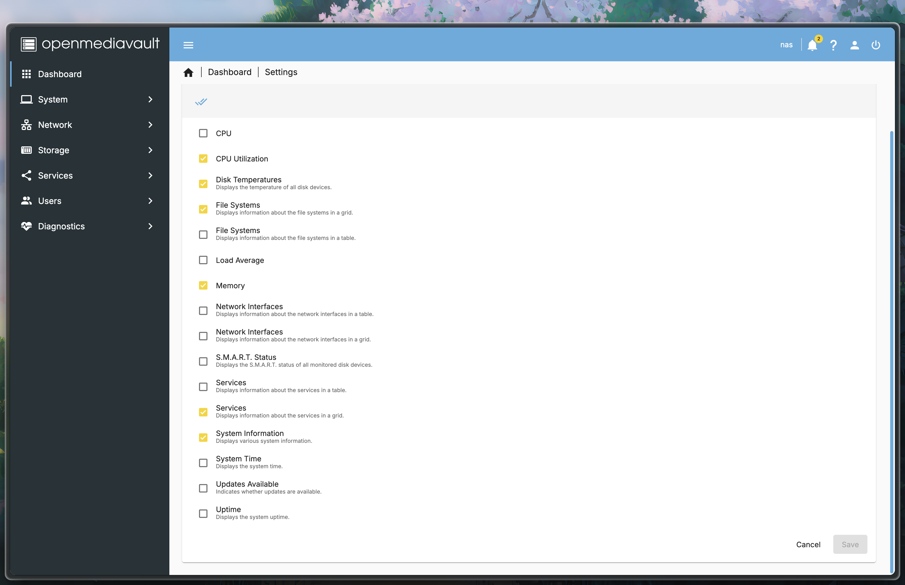
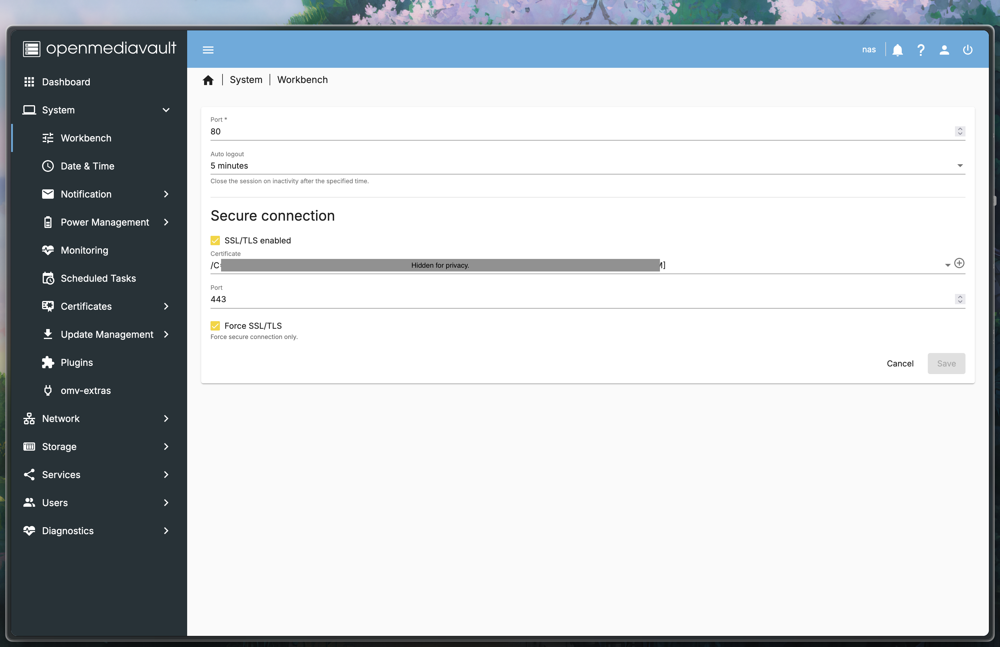
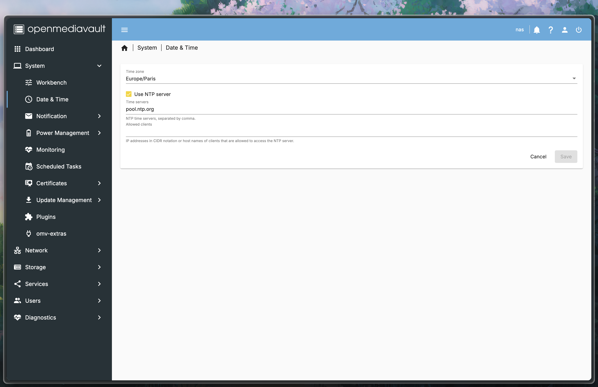
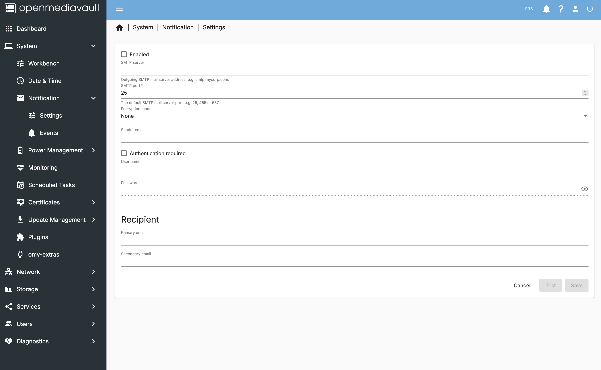
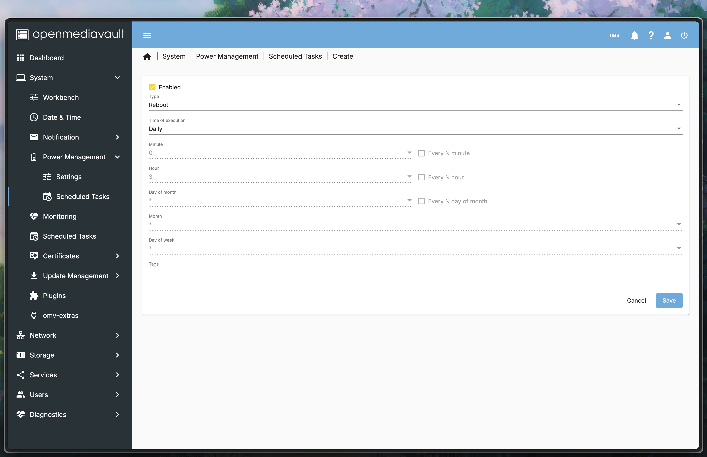
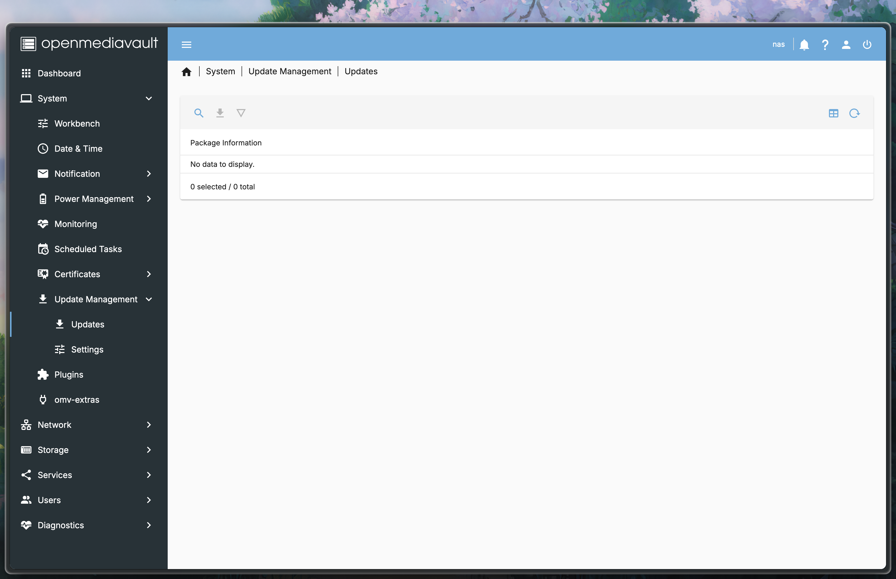
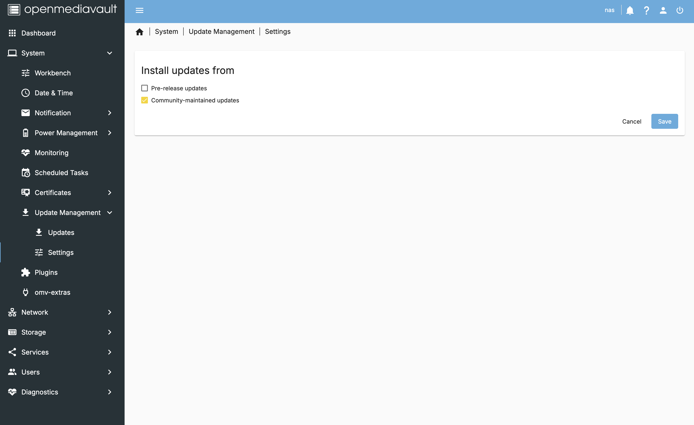
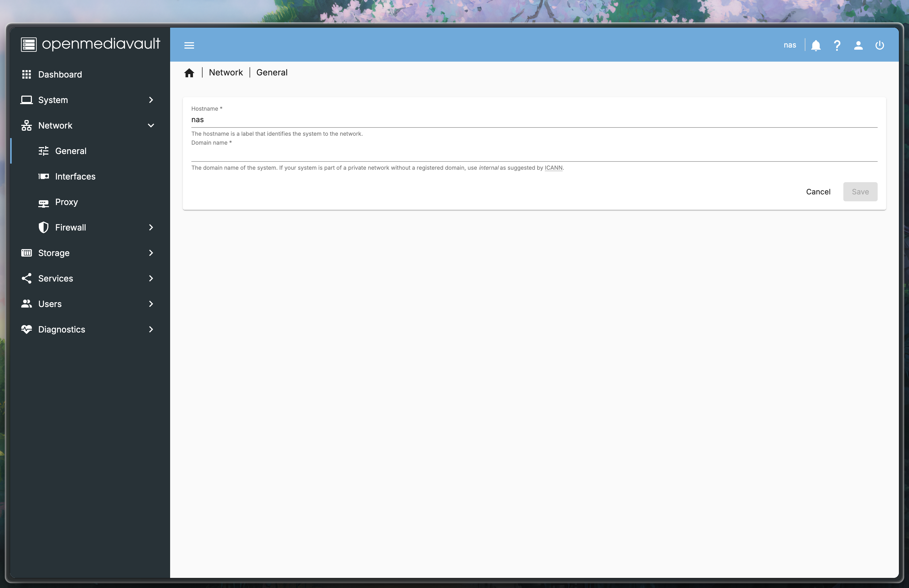
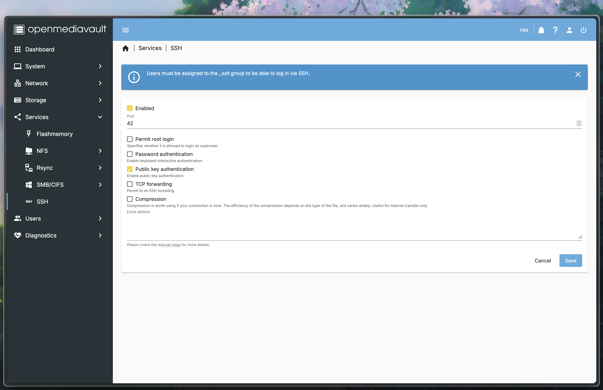

# OpenMediaVault Installation

> This guide will help you to set up a NAS using OpenMediaVault on a Raspberry Pi.

- **Want to go back to the index page?** [click here](../index.md).

## Table of Contents

- [OpenMediaVault Installation](#openmediavault-installation)
  - [Table of Contents](#table-of-contents)
  - [I - Installation on the Pi](#i---installation-on-the-pi)
    - [Install OpenMediaVault on the Pi](#install-openmediavault-on-the-pi)
    - [First login](#first-login)
  - [II - Networking](#ii---networking)
    - [Firewall configuration](#firewall-configuration)
      - [Allow your client PC](#allow-your-client-pc)
      - [Allow DNS Traffic](#allow-dns-traffic)
      - [Allow ICMP Traffic](#allow-icmp-traffic)
      - [Block access to other VLANs](#block-access-to-other-vlans)
      - [Allow Cloudflare traffic](#allow-cloudflare-traffic)
    - [Allow HTTP and HTTPS traffic](#allow-http-and-https-traffic)
      - [Default rules](#default-rules)
      - [IPv6 rules](#ipv6-rules)
    - [Create a backup](#create-a-backup)
  - [Next step](#next-step)
  - [Sources](#sources)

## I - Installation on the Pi

In this section, we will install OpenMediaVault on the Pi to have a nice web interface to manage the NAS.

### Install OpenMediaVault on the Pi

> OpenMediaVault is a free network-attached storage server based on the Debian operating system. It contains services like SSH, (S)FTP, SMB, NFS, Rsync, and more.

- First, we will run the pre-installation script, and fill the password as requested:

```bash
wget -O - https://github.com/OpenMediaVault-Plugin-Developers/installScript/raw/master/preinstall | sudo bash
```

- Once the script is done, we reboot the Pi:

```bash
sudo reboot
```

- After the reboot, we run the installation script and provide the password, this may take a while depending on your internet connection:

```bash
wget -O - https://github.com/OpenMediaVault-Plugin-Developers/installScript/raw/master/install | sudo bash
```

- The installation script will automatically reboot. This time, do not connect to the Pi, but go to your browser and type the IP address of the Pi. (ex: `http://192.168.1.x` or [`http://myhomenas.local`](http://myhomenas.local))

> [!WARNING]
> The default page is not secure (e. g. no HTTPS). Your browser may block the connection. You can bypass this by clicking on `Advanced` and then `Proceed to the IP address` or find another browser that does not block the connection.

- The default username is `admin` and the default password is `openmediavault`.

### First login

> We will scroll down from the `Dashboard` to the `Diagnostics` menu and stop by every relevant section to check the status of the services.

- Once logged in, I strongly recommend you to change the default password by clicking to your profile and then `Change Password` (choose a strong password, at least 30 characters and store it in your password manager).


- You will be prompted to change the widgets on your dashboard, here is my selection:



- As we saw earlier, the default protocol is HTTP. We will change it to HTTPS to secure the connection by creating self-signed certificates in the `Workbench` section. I woumd also recommend to enforce the use of HTTPS by checking the `Force SSL/TLS` box.



- Now in `Date & Time`, you may want to change the timezone to your location:



- It could also prove useful to configure an email client that would notify you on update or issues with the NAS. You can find the settings in the `Notifications` > `Settings` (client) & `Events` (selection) sections.



- Under the `Power Management` > `Scheduled Tasks` section, you can configure the NAS to reboot everyday at 3am for example.



- In the `Update Management` section, be sure to stay up-to-date with the latest updates. I would recomment checking the `Community-maintained updates` box.





- We will explore the `Plugins` section later.

- In the `Network` > `General` ensure that the `Hostname` is set to `nas` or `myhomenas`.



- In the `Network` > `Interfaces` section, select the interface that is connected by ethernet and fill the `DNS servers` with `1.1.1.1,1.0.0.1` and the `Search domain` with `localdomain`.


- Finally, go to `Services` > `SSH` and update the port to `42`, then disable `root login` and `password authentication`.



## II - Networking

### Firewall configuration

> The firewall is a security feature that blocks unwanted traffic from entering your network. We will configure the firewall to allow only the necessary traffic.

- Go to the `Network` > `Firewall` section. Note that there are two panels: `IPv4` and `IPv6`. The order matters, so we will start with the `IPv4` panel.

> [!NOTE]
> You may apply the pending changes at the end of each section.

#### Allow your client PC

- We will allow the IP address of your **Client PC** to connect to the Pi to manage it considering that your IP is `192.168.2.1`.

> - Direction: `INPUT`
> - Action: `ACCEPT`
> - Source: `192.168.2.1`
> - Protocol: `All`
> - Tags: `Admin`

> - Direction: `OUTPUT`
> - Action: `ACCEPT`
> - Destination: `192.168.2.1`
> - Protocol: `All`
> - Tags: `Admin`

- (Optional) We can also allow logging from the ssh client (on the custom port `42`).

> - Direction: `INPUT`
> - Action: `LOG`
> - Destination Port: `42`
> - Protocol: `TCP`
> - Tags: `Logging`

#### Allow DNS Traffic

- We will allow DNS traffic to resolve domain names.

> - Direction: `OUTPUT`
> - Action: `ACCEPT`
> - Destination Port: `53`
> - Protocol: `UDP`
> - Tags: `DNS`

> - Direction: `OUTPUT`
> - Action: `ACCEPT`
> - Destination Port: `53`
> - Protocol: `UDP`
> - Tags: `DNS`

#### Allow ICMP Traffic

- We will allow ICMP traffic to ping the Pi.

> - Direction: `INPUT`
> - Action: `ACCEPT`
> - Protocol: `ICMP`
> - Tags: `Ping`

> - Direction: `OUTPUT`
> - Action: `ACCEPT`
> - Protocol: `ICMP`
> - Tags: `Ping`

#### Block access to other VLANs

- Consider setting the Pi on a separate VLAN, we will block access to and from other devices on the network.

> - Direction: `INPUT`
> - Action: `REJECT`
> - Source: `192.168.1.0/24`
> - Protocol: `All`
> - Tags: `VLAN`

> - Direction: `OUTPUT`
> - Action: `REJECT`
> - Destination: `192.168.1.0/24`
> - Protocol: `All`
> - Tags: `VLAN`

#### Allow Cloudflare traffic

- We allow Cloudflare's IP addresses to target the Pi only to the port `7844`.

> - Direction: `INPUT`
> - Action: `ACCEPT`
> - Source: `103.21.244.0/22`
> - Source Port: `7844`
> - Protocol: `TCP`
> - Tags: `Cloudflare`

> - Direction: `INPUT`
> - Action: `ACCEPT`
> - Source: `103.22.200.0/22`
> - Source Port: `7844`
> - Protocol: `TCP`
> - Tags: `Cloudflare`

> - Direction: `INPUT`
> - Action: `ACCEPT`
> - Source: `103.31.4.0/22`
> - Source Port: `7844`
> - Protocol: `TCP`
> - Tags: `Cloudflare`

> - Direction: `INPUT`
> - Action: `ACCEPT`
> - Source: `104.16.0.0/13`
> - Source Port: `7844`
> - Protocol: `TCP`
> - Tags: `Cloudflare`

> - Direction: `INPUT`
> - Action: `ACCEPT`
> - Source: `104.24.0.0/14`
> - Source Port: `7844`
> - Protocol: `TCP`
> - Tags: `Cloudflare`

> - Direction: `INPUT`
> - Action: `ACCEPT`
> - Source: `108.162.192.0/18`
> - Source Port: `7844`
> - Protocol: `TCP`
> - Tags: `Cloudflare`

> - Direction: `INPUT`
> - Action: `ACCEPT`
> - Source: `131.0.72.0/22`
> - Source Port: `7844`
> - Protocol: `TCP`
> - Tags: `Cloudflare`

> - Direction: `INPUT`
> - Action: `ACCEPT`
> - Source: `141.101.64.0/18`
> - Source Port: `7844`
> - Protocol: `TCP`
> - Tags: `Cloudflare`

> - Direction: `INPUT`
> - Action: `ACCEPT`
> - Source: `162.158.0.0/15`
> - Source Port: `7844`
> - Protocol: `TCP`
> - Tags: `Cloudflare`

> - Direction: `INPUT`
> - Action: `ACCEPT`
> - Source: `172.64.0.0/13`
> - Source Port: `7844`
> - Protocol: `TCP`
> - Tags: `Cloudflare`

> - Direction: `INPUT`
> - Action: `ACCEPT`
> - Source: `173.245.48.0/20`
> - Source Port: `7844`
> - Protocol: `TCP`
> - Tags: `Cloudflare`

> - Direction: `INPUT`
> - Action: `ACCEPT`
> - Source: `188.114.96.0/20`
> - Source Port: `7844`
> - Protocol: `TCP`
> - Tags: `Cloudflare`

> - Direction: `INPUT`
> - Action: `ACCEPT`
> - Source: `190.93.240.0/20`
> - Source Port: `7844`
> - Protocol: `TCP`
> - Tags: `Cloudflare`

> - Direction: `INPUT`
> - Action: `ACCEPT`
> - Source: `197.234.240.0/22`
> - Source Port: `7844`
> - Protocol: `TCP`
> - Tags: `Cloudflare`

> - Direction: `INPUT`
> - Action: `ACCEPT`
> - Source: `198.41.128.0/17`
> - Source Port: `7844`
> - Protocol: `TCP`
> - Tags: `Cloudflare`

### Allow HTTP and HTTPS traffic

> - Direction: `OUTPUT`
> - Action: `ACCEPT`
> - Destination Port: `443`
> - Protocol: `TCP`
> - Tags: `HTTPS`

> - Direction: `INPUT`
> - Action: `ACCEPT`
> - Source Port: `443`
> - Protocol: `TCP`
> - Tags: `HTTPS`

> - Direction: `OUTPUT`
> - Action: `ACCEPT`
> - Destination Port: `80`
> - Protocol: `TCP`
> - Tags: `HTTP`

> - Direction: `INPUT`
> - Action: `ACCEPT`
> - Source Port: `80`
> - Protocol: `TCP`
> - Tags: `HTTP`

#### Default rules

- Allow loopback traffic:

> - Direction: `INPUT`
> - Action: `ACCEPT`
> - Source: `127.0.0.0/8`
> - Protocol: `All`
> - Tags: `Loopback`

- These default rules will block all incoming traffic and allow all outgoing traffic on the IPv4 channel by default, but we will add some rules to allow only the necessary traffic.

> - Direction: `INPUT`
> - Action: `REJECT`
> - Protocol: `All`
> - Tags: `Default deny`

> - Direction: `OUTPUT`
> - Action: `ACCEPT`
> - Protocol: `All`
> - Tags: `Default allow`

#### IPv6 rules

> We will now add similar rules for the IPv6 channel.

- Let's start by allowing the DNS traffic:

> - Direction: `OUTPUT`
> - Action: `ACCEPT`
> - Destination port: `53`
> - Protocol: `UDP`
> - Tags: `DNS`

- Allow ICMPv6 traffic:

> - Direction: `INPUT`
> - Action: `ACCEPT`
> - Protocol: `ICMPv6`
> - Tags: `Ping`

> - Direction: `OUTPUT`
> - Action: `ACCEPT`
> - Protocol: `ICMPv6`
> - Tags: `Ping`

- Finally, block unwanted traffic:

> - Direction: `INPUT`
> - Action: `REJECT`
> - Protocol: `All`
> - Tags: `Default deny`

> - Direction: `OUTPUT`
> - Action: `REJECT`
> - Protocol: `All`
> - Tags: `Default deny`

### Create a backup

> Before proceeding to the next steps, we will now create a backup. This will help you to restore your system in case of a failure up to this point.

- Back to your Pi, create your backup location:

```bash
sudo mkdir /backup
cd /backup
```

- Create a backup script:

```bash
sudo nano /backup/backup.sh
```

```plaintext
#!/bin/bash

# Variables
BACKUP_DIR="/backup"
DATE=$(date +"%Y%m%d-%H%M%S")

# Backup
sudo dd if=/dev/mmcblk0 bs=1M | gzip > $BACKUP_DIR/backup-$DATE.img.gz
```

- Make the script executable:

```bash
sudo chmod +x /backup/backup.sh
```

- And we execute it (it may take a while):

```bash
sudo ./backup.sh
```

- Then get the name of the backup:

```bash
ls -l /backup
```

- Exit the Pi and copy the backup to your **Client PC** (replace the date with the one of your backup):

```bash
cd ~/Downloads
scp nas:/backup/backup-20240101-000000.img.gz .
```

- You may decompress the backup with the following command:

```bash
gunzip backup-20240101-000000.img.gz
```

- To restore the backup, you will need to flash the image to the SD card or a new one using [Balena Etcher](https://etcher.balena.io/) as we did in the first section but use this image instead.

## Next step

You may now proceed to the [OpenMediaVault](./omv-storage.md) storage management section.

## Sources

Here is the most exhaustive I could make of the sources I used to write this guide:

- [Wiki for the installation on Raspberry Pi and affiliates](https://wiki.omv-extras.org/doku.php?id=omv7:raspberry_pi_install) from the [omv-extras](https://wiki.omv-extras.org/doku.php?id=start) documentation
- [Wiki for the walkthrough of the setup on the WebGUI](https://wiki.omv-extras.org/doku.php?id=omv7:new_user_guide#web_console_login) from the [omv-extras](https://wiki.omv-extras.org/doku.php?id=start) documentation

---

Last update: Jan. 2025
Created: Oct. 2024
