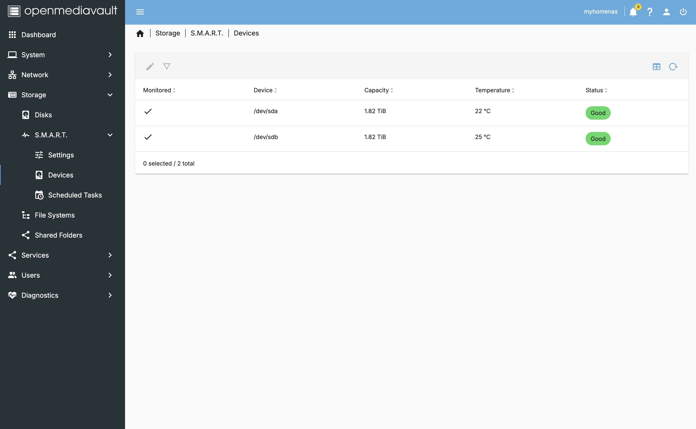
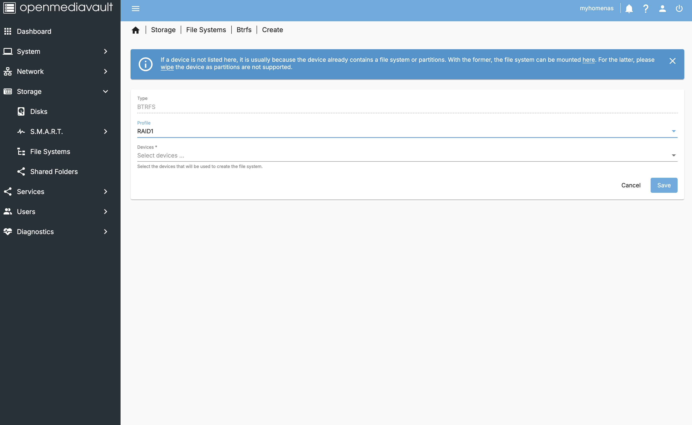
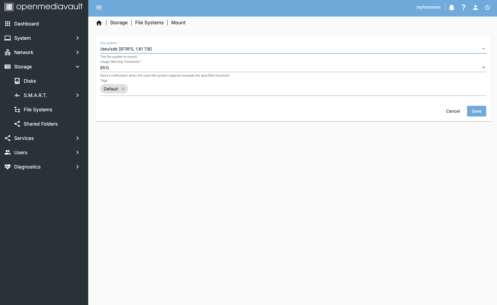

# OpenMediaVault storage management

> This guide will help you set up your storage devices on OpenMediaVault. It will cover the checkup and monitoring of the drives, the creation of a Btrfs file system, and the creation of shared folders.

- **Want to go back to the index page?** [click here](../index.md).

## Table of Contents

- [OpenMediaVault storage management](#openmediavault-storage-management)
  - [Table of Contents](#table-of-contents)
  - [I - Checkup and monitoring](#i---checkup-and-monitoring)
  - [II - Btrfs](#ii---btrfs)
    - [First scenario: 2 portable HDD](#first-scenario-2-portable-hdd)
    - [Second scenario: 3 HDD](#second-scenario-3-hdd)
  - [III - Shared folders](#iii---shared-folders)
  - [Next step](#next-step)

## I - Checkup and monitoring

> This section will be about checking the status of the drives and enabling monitoring on each one of them (if they are SMART compatible).

- Check that all the devices you connected appear in `Storage` > `Disks`. Note that `/dev/mmcblk0` is the SD card where the OS is installed.

- Then go to `Storage` > `SMART` > `Settings` and set:
  - `check interval` to `1800`
  - `power mode` to `standby`
  - `Temperature monitoring` to `disabled`.

- Then go to `Storage` > `SMART` > `Devices` and enable monitoring on each device that supports it by editing the device and setting `Monitoring enabled` to `yes`.

## II - Btrfs

> Btrfs is a modern copy-on-write file system for Linux that provides features like snapshots, subvolumes, RAID, and more. It's an excellent alternative to ZFS, offering similar benefits.

### First scenario: 2 portable HDD

> This scenario is about creating a RAID 1 (mirroring) array with 2 portable hard drives. The drives should be the same size and have the same partition layout. You may erase them before this process.

- Go to `Storage` > `File Systems` and click on `Create` to create a new file system. Choose `BTRFS` and select the devices you want to use.

- After completion, fill the fields as follows:

### Second scenario: 3 HDD

> coming soon.

## III - Shared folders

> This section will tackle your first shared folder creation.

- Go to `Storage` > `Shared Folders` and click on `Add`. Fill the fields as follows:

- Hit Save and Apply pending configuration changes.

## Next step

You may now proceed to the [OMV docker & Cloudflare tunnel](./omv-docker.md) setup.

---

Last update: Jan. 2025
Created: Oct. 2024
