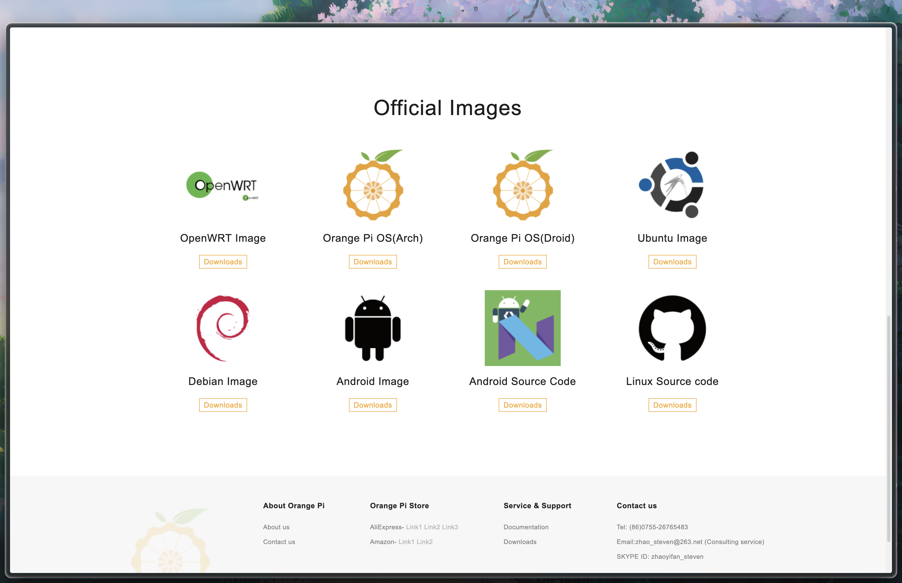

# Orange Pi Setup

> This guide will help you to setup your Orange Pi SBC with a secure environment and some useful tools. The goal is to prepare the SBC to install and config OMV.

- **Want to go back to the index page?** [click here](../index.md).

## Table of Contents

- [Orange Pi Setup](#orange-pi-setup)
  - [Table of Contents](#table-of-contents)
  - [I - Installation](#i---installation)
    - [Flash the SBC](#flash-the-sbc)
    - [Setting up IP addresses](#setting-up-ip-addresses)
  - [II - Basic configuration](#ii---basic-configuration)
    - [Disabling Bluetooth](#disabling-bluetooth)
    - [Changing the timezone](#changing-the-timezone)
    - [Changing the hostname](#changing-the-hostname)
    - [Preventing a known issue with vfat system](#preventing-a-known-issue-with-vfat-system)
    - [Changing the package repositories](#changing-the-package-repositories)
    - [Updating DNS](#updating-dns)
  - [III - Adding a new user](#iii---adding-a-new-user)
    - [Setting up a new user](#setting-up-a-new-user)
    - [SSH key setup - Client PC](#ssh-key-setup---client-pc)
    - [SSH key setup - Server](#ssh-key-setup---server)
  - [IV - Configuring the environment](#iv---configuring-the-environment)
    - [Editor](#editor)
    - [Changing the default shell](#changing-the-default-shell)
    - [Adding some useful tools](#adding-some-useful-tools)
    - [Adding Endlessh](#adding-endlessh)
    - [Bonus - File manager](#bonus---file-manager)
  - [Next step](#next-step)
  - [Sources](#sources)

## I - Installation

This section will be focusing on the installation of the SBC and the configuration of the network.

### Flash the SBC

> Flashing the SBC is the first step to get it up and running. We will use the official OS image for the Orange Pi.

- Download the OS image for your specific SBC from the official websites (i. e. [Orange Pi OS](http://www.orangepi.org/html/serviceAndSupport/index.html) as we are using an Orange Pi SBC).



- Flash the SD card using [Balena Etcher](https://etcher.balena.io/) with the downloaded image.

- Before plugging the SD card into the SBC, plug your ethernet cable into the SBC and your router if you have one. Otherwise, you may need to connect a monitor, a keyboard and a mouse to configure the network settings.

- Insert the SD card into the SBC and boot it up.

- Retrieve the `IP address` of the SBC by checking the connected devices on your router's admin panel or by using a network scanner like [`nmap`](https://www.redhat.com/en/blog/quick-nmap-inventory) (or use the monitor to check the IP address).

### Setting up IP addresses

> Setting up IP addresses is a crucial step to manage your network and improve its security.

In a typical local network setup, the IP range `192.168.1.x` is used and managed by your router through DHCP. To enhance network management and security, it's beneficial to utilize static IP addresses for certain devices.

- 192.168.1.1-50: [DHCP] For standard devices such as phones, tablets, laptops, and smart TVs.
- 192.168.1.51-100: [Static IP] For permanent devices like a development laptop, desktop, or printer. In this example, let's assume your **Client PC** is assigned the static IP `192.168.1.51`.
- 192.168.1.101-200: [Static IP] For servers like a Network Attached Storage (NAS), PiHole, or Home Assistant. Your Single Board Computer (SBC) might be assigned the static IP `192.168.1.101`.

## II - Basic configuration

From now on we will consider that your SBC is an OrangePi. Some part may need to be adapted to your SBC.

Now that your SBC is up and running, you can connect to it using SSH and fix some common known issues.

### Disabling Bluetooth

> If enabled but not used, the Bluetooth service can be a security breach. It is recommended to disable it.

- Connect to your SBC using SSH, the default password is `orangepi`.

```bash
ssh orangepi@192.168.1.x
```

- Enter the config panel to remove the Bluetooth service (`Network` > `Remove BT`) with the command:

```bash
sudo orangepi-config
```

Seeing `Install BT` means that the Bluetooth service is already disabled.

### Changing the timezone

> The default timezone may not be the one you are living in. We will change it to match your location.

- Change the timezone (`Personal` > `Timezone`) with the command:

```bash
sudo orangepi-config
```

### Changing the hostname

> The hostname is the name of your device on the network. It is used to identify your device and to access it remotely.

- While still being connected to the SBC, change the hostname (`Personal` > `Hostname`) with the command:

```bash
sudo orangepi-config
```

You may replace the current hostname with `myhomenas`.

- Reboot the SBC to apply the changes:

```bash
sudo reboot
```

### Preventing a known issue with vfat system

> the error raised here when installing/removing a package:
>
> ```plaintext
> ln: failed to create hard link '/boot/initrd.img-5.10.110-rockchip-rk3588.dpkg-bak' => '/boot/initrd.img-5.10.110-rockchip-rk3588': Operation not permitted
> update-initramfs: Generating /boot/initrd.img-5.10.110-rockchip-rk3588
> update-initramfs: Converting to u-boot format
> ```
>
> We will resolve it by changing the hard link to a copy.

- First, create a backup of the original `update-initramfs` script:

```bash
sudo cp /usr/sbin/update-initramfs /usr/sbin/update-initramfs.bak
```

- Then edit the script:

```bash
sudo nano /usr/sbin/update-initramfs
```

- Find the following line:

```plaintext
backup_initramfs()
{
        [ ! -r "${initramfs}" ] && return 0
        initramfs_bak="${initramfs}.dpkg-bak"
        [ -r "${initramfs_bak}" ] && rm -f "${initramfs_bak}"
        ln -f "${initramfs}" "${initramfs_bak}" \
                || cp -a "${initramfs}" "${initramfs_bak}"
        verbose "Keeping ${initramfs_bak}"
}
```

- Replace it with the following then save and exit:

```plaintext
backup_initramfs()
{
        [ ! -r "${initramfs}" ] && return 0
        initramfs_bak="${initramfs}.dpkg-bak"
        [ -r "${initramfs_bak}" ] && rm -f "${initramfs_bak}"
        cp -a "${initramfs}" "${initramfs_bak}"
        verbose "Keeping ${initramfs_bak}"
}
```

- Finally, update the initramfs:

```bash
sudo update-initramfs -u
```

- Reboot the SBC to apply the changes:

```bash
sudo reboot
```

### Changing the package repositories

> The default package repositories may not be up-to-date and target chinese servers. We will change them to use the official Debian repositories.

- Using ssh, get back on the Pi, edit the `/etc/apt/sources.list` file:

```bash
sudo nano /etc/apt/sources.list
```

- Replace the current content with the following:

```plaintext
deb http://deb.debian.org/debian/ bookworm main contrib non-free non-free-firmware
deb-src http://deb.debian.org/debian/ bookworm main contrib non-free non-free-firmware

deb http://security.debian.org/debian-security bookworm-security main contrib non-free non-free-firmware
deb-src http://security.debian.org/debian-security bookworm-security main contrib non-free non-free-firmware

deb http://deb.debian.org/debian/ bookworm-updates main contrib non-free non-free-firmware
deb-src http://deb.debian.org/debian/ bookworm-updates main contrib non-free non-free-firmware
```

- Update the docker list at `/etc/apt/sources.list.d/docker.list`:

```bash
sudo nano /etc/apt/sources.list.d/docker.list
```

```plaintext
deb [arch=amd64 signed-by=/etc/apt/keyrings/docker-archive-keyring.gpg] https://download.docker.com/linux/debian bookworm stable
```

- Remove Docker's GPG key from the legacy trusted.gpg keyring:

```bash
sudo apt-key --keyring /etc/apt/trusted.gpg del 9DC858229FC7DD38854AE2D88D81803C0EBFCD88
```

- Downlaod Docker's GPG key:

```bash
curl -fsSL https://download.docker.com/linux/debian/gpg | sudo gpg --dearmor -o /etc/apt/keyrings/docker-archive-keyring.gpg
```

- Update the package list:

```bash
sudo apt update
```

- If no error shows up, install the `nala` package to get a nicer package manager:

```bash
sudo apt install nala -y
```

- Then proceed to upgrade the other packages:

```bash
sudo nala upgrade -y
```

- Reboot the SBC to apply the changes:

```bash
sudo reboot
```

### Updating DNS

> Cloudflare's DNS is known to be faster and more secure than the default DNS servers.

- Update the DNS server to use Cloudflare's DNS:

```bash
sudo nano /etc/resolv.conf
```

```plaintext
search localdomain
nameserver 1.1.1.1
nameserver 1.0.0.1
```

- Test the DNS resolution:

```bash
nslookup google.com
```

- Restart the network service:

```bash
sudo service networking restart
```

## III - Adding a new user

In this section, we will create a new user, disable the default user and setup SSH keys to connect to the Pi.

### Setting up a new user

> Creating a new user and disabling the default user is a good practice to secure your server by managing granularly your user's permissions.

- First we change the default password for `root`:

```bash
sudo passwd root
```

- Then we edit the sudoers permissions:

```bash
sudo chmod 750 /etc/sudoers.d
```

- Create a new user named `sysadmin`:

```bash
sudo adduser sysadmin
```

- Add the user to the sudo group:

```bash
sudo usermod -aG sudo sysadmin
```

- Login as the new user:

```bash
su - sysadmin
```

> [!WARNING]
> The `orangepi` cannot be deleted as it is the default user. Consequently, we will lock the user, so that no one can access it.

- To diasble the orangepi user, we first need to lock the user:

```bash
sudo passwd -l orangepi
```

- Then we set the expiration date to day 1 (e. g. January 2, 1970):

```bash
sudo usermod --expiredate 1 orangepi
```

- Remove the user from the sudo group:

```bash
sudo deluser orangepi sudo
```

- Edit the ssh configuration file to add the following line:

```bash
sudo nano /etc/ssh/sshd_config
```

```plaintext
DenyUsers orangepi
```

- Finally, reboot and reconnect to the Pi:

```bash
ssh sysadmin@192.168.1.x
```

> [!WARNING]
> Keep a terminal open on the Pi.

### SSH key setup - Client PC

> We create a keypair of public and private keys to connect to the Pi without using a password. This is more secure than using a password.

- Back to your client computer, generate a new SSH key:

> - `-f ~/.ssh/myhomenas`: is optional and indicates the path to the key file.
> - `-C "myhomenas"`: is optional and adds a comment to the key.
> - `-N "yourpassphrase"`: is optional and adds a passphrase to the key to enter when using it.

```bash
ssh-keygen -f ~/.ssh/myhomenas -C "myhomenas" -N "yourpassphrase"
```

- Display the publickey to copy it later:

```bash
cat ~/.ssh/myhomenas.pub
```

- Add the key to your ssh-agent:

```bash
ssh-add ~/.ssh/myhomenas
```

- Set the host at the top of your `~/.ssh/config` file and replace the IP address with the one of your Pi:

```bash
sudo nano ~/.ssh/config
```

```plaintext
Host myhomenas
  User sysadmin
  HostName 192.168.1.x
  Port 42
  PreferredAuthentications publickey
  IdentityFile ~/.ssh/myhomenas
```

### SSH key setup - Server

> We will add the public key to the Pi to allow the client computer to connect without a password.

- Back to the Pi, create the `.ssh` directory if it does not exist:

```bash
mkdir -p ~/.ssh
chmod 700 ~/.ssh
```

- Create the `authorized_keys` file and copy the public key:

```bash
nano ~/.ssh/authorized_keys
```

```plaintext
ssh-ed25519 something_long_with_numbers_and_letters myhomenas
```

- Edit the `sshd_config` file:

```bash
sudo nano /etc/ssh/sshd_config
```

Find and change the following lines:

```plaintext
Port 42
PermitRootLogin no
PasswordAuthentication no
```

- Reboot to apply changes:

```bash
sudo reboot
```

- And finally, connect to the Pi using the new user:

```bash
ssh myhomenas
```

## IV - Configuring the environment

In this section, we will add some services to secure the Pi and to monitor it.

### Editor

> The default editor of this tutorial is `nano`. If you are like me and would like to try a fancy version of nano, try `micro`. Otherwise, you may skip this part.

- Install the `micro` package:

```bash
sudo nala install micro -y
```

- Set the `micro` editor as the default editor by adding the following line to the `.zshrc` file:

```bash
nano ~/.zshrc
```

```plaintext
export EDITOR="micro"
alias nano="micro"
alias sudo='sudo '
```

> [!NOTE]
>
> - `ctrl + c` to copy
> - `ctrl + x` to cut
> - `ctrl + v` to paste
> - `ctrl + s` to save
> - `ctrl + q` to quit

### Changing the default shell

> The default shell of the OrangePi is `bash`. We will change it to `zsh` to have a more modern and customizable shell.

- As `zsh` is already installed alongside `oh-my-zsh`, we will change the default shell:

```bash
chsh -s /bin/zsh
```

- Reboot to reconnect with the new shell:

```bash
sudo reboot
ssh myhomenas
```

### Adding some useful tools

> These are optional but can be useful to manage your server.

- Install `libpam-tmpdir` for better management of temporary directories:

```bash
sudo nala install libpam-tmpdir -y
```

- Install `needrestart` to check if a service needs to be restarted after an update:

```bash
sudo nala install needrestart -y
```

### Adding Endlessh

TODO: Not working after omv installation.

> Endlessh is an SSH tarpit that very slowly sends an endless, random SSH banner. This will keep bots connected to your server for a long time, wasting their resources.

- Install the `endlessh` package:

```bash
mkdir -p ~/tools
cd ~/tools
git clone https://github.com/skeeto/endlessh
cd endlessh
make
sudo make install
sudo cp util/endlessh.service /etc/systemd/system
```

- Enable the service:

```bash
sudo systemctl enable endlessh
```

- Update the config file:

```bash
sudo mkdir -p /etc/endlessh
cd /etc/endlessh
sudo nano config
```

```plaintext
# The port on which to listen for new SSH connections.
Port 22

# The endless banner is sent one line at a time. This is the delay
# in milliseconds between individual lines.
Delay 10000

# The length of each line is randomized. This controls the maximum
# length of each line. Shorter lines may keep clients on for longer if
# they give up after a certain number of bytes.
MaxLineLength 32

# Maximum number of connections to accept at a time. Connections beyond
# this are not immediately rejected, but will wait in the queue.
MaxClients 4096

# Set the detail level for the log.
#   0 = Quiet
#   1 = Standard, useful log messages
#   2 = Very noisy debugging information
LogLevel 0

# Set the family of the listening socket
#   0 = Use IPv4 Mapped IPv6 (Both v4 and v6, default)
#   4 = Use IPv4 only
#   6 = Use IPv6 only
BindFamily 0
```

- Start the service:

```bash
sudo systemctl start endlessh
```

### Bonus - File manager

> Yazi is a simple file manager that can be used to manage files on your server with a nice UI.

- As we can only build from source, we install rust:

```bash
curl --proto '=https' --tlsv1.2 -sSf https://sh.rustup.rs | sh
source $HOME/.cargo/env
```

- Install the `yazi` package:

```bash
cd ~/tools
git clone https://github.com/sxyazi/yazi.git
cd yazi
```

- Install the dependencies:

```bash
sudo nala install build-essential libssl-dev
```

- Build the project:

```bash
cargo build --release
```

- Finally, we add a wrapper to the `~/.zshrc` file:

```bash
nano ~/.zshrc
```

```plaintext
export PATH="$HOME/tools/yazi/target/release:$PATH"

# Wrapper for the yazi file manager
function y() {
	local tmp="$(mktemp -t "yazi-cwd.XXXXXX")" cwd
	yazi "$@" --cwd-file="$tmp"
	if cwd="$(command cat -- "$tmp")" && [ -n "$cwd" ] && [ "$cwd" != "$PWD" ]; then
		builtin cd -- "$cwd"
	fi
	rm -f -- "$tmp"
}
```

After rebooting, you may now use the `y` command to open the file manager (you may exit the file manager by pressing `q`).

## Next step

You may now proceed to the [OpenMediaVault](./omv-first-boot.md) installation.

## Sources

Here is the most exhaustive I could make of the sources I used to write this guide:

- [Orange Pi 5 Plus Specs](http://www.orangepi.org/html/hardWare/computerAndMicrocontrollers/details/Orange-Pi-5-plus.html) from its [OrangePi](http://www.orangepi.org/html/hardWare/computerAndMicrocontrollers/details/Orange-Pi-5-plus.html) documentation.
- [Orange Pi - Setting Up a Secure Web Server on a Single Board Computer](https://ambientnode.uk/orange-pi-webhost/) By [Zsolt Bizderi](https://ambientnode.uk/author/zsolt/)
- [Installation on Debian for OpenMediaVault](https://docs.openmediavault.org/en/stable/installation/on_debian.html) from the [OpenMediaVault](https://docs.openmediavault.org/en/stable/index.html) documentation

---

Last update: Jan. 2025

Created: Oct. 2024
