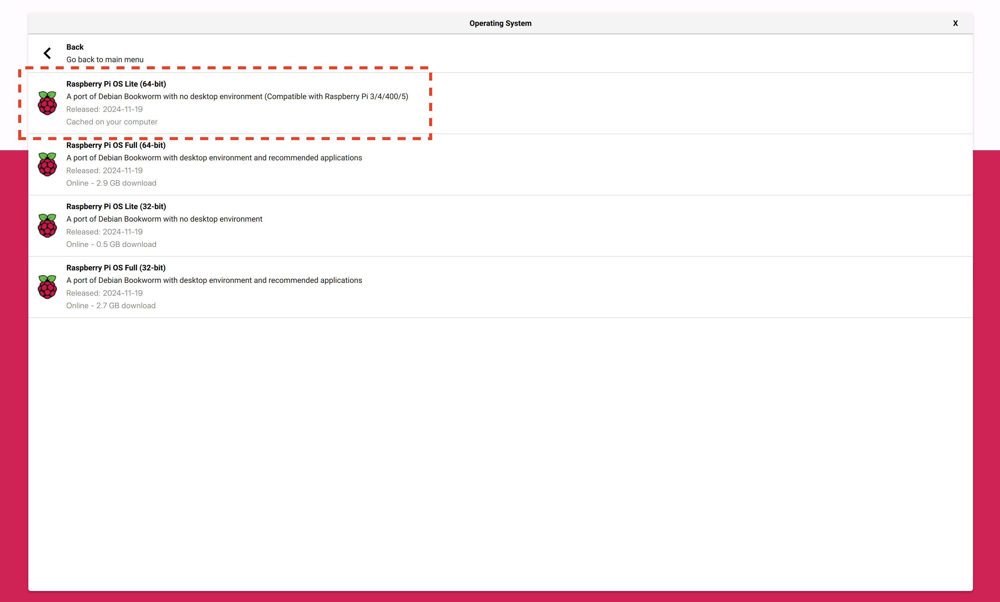
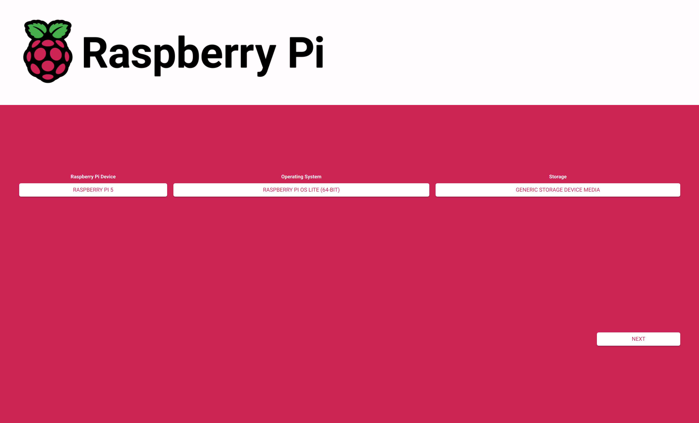
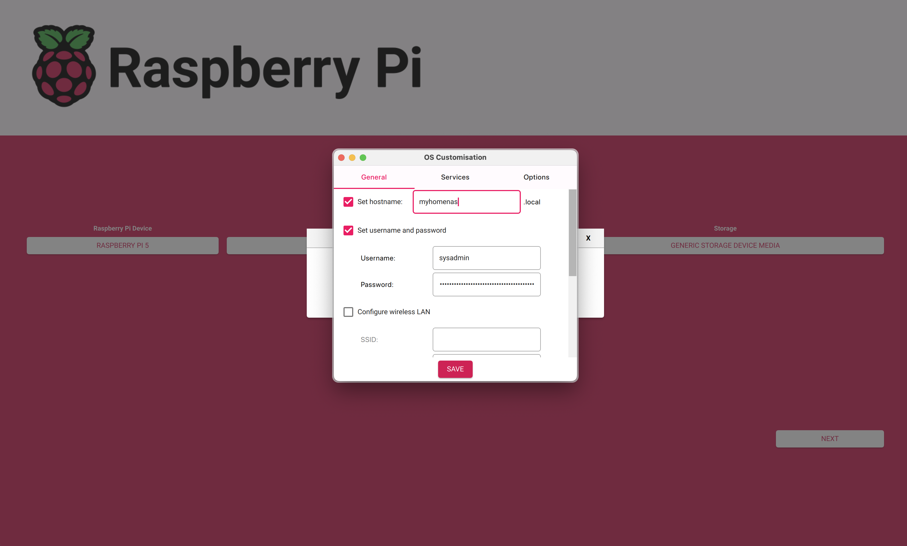
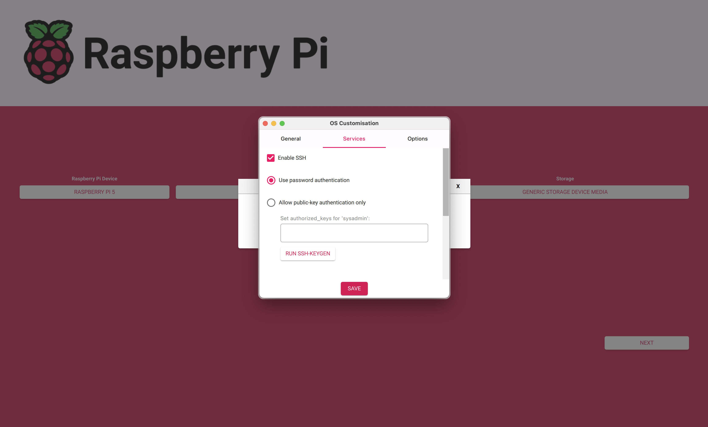
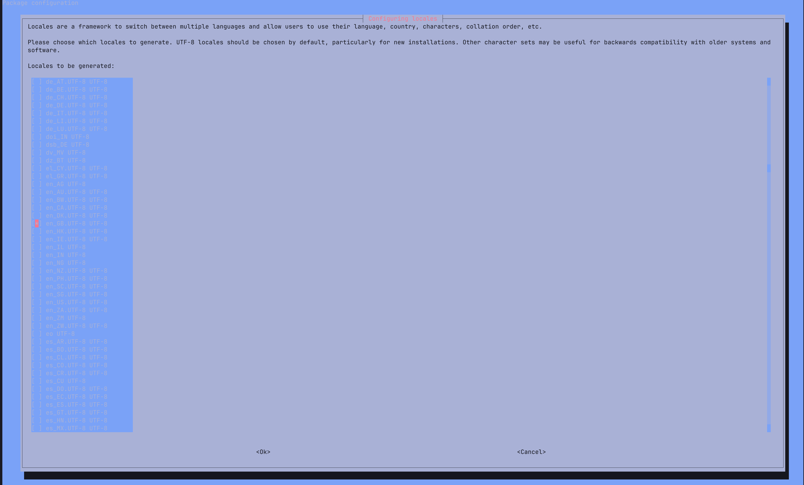

# Raspberry Pi Setup

> This guide will help you to setup a Raspberry Pi with a secure configuration and some useful tools. The goal is to prepare the SBC to install and config OMV.

- **Want to go back to the index page?** [click here](../index.md).

## Table of Contents

- [Raspberry Pi Setup](#raspberry-pi-setup)
  - [Table of Contents](#table-of-contents)
  - [I - Installation](#i---installation)
    - [Flash the SBC](#flash-the-sbc)
    - [Setting up IP addresses](#setting-up-ip-addresses)
  - [II - Basic configuration](#ii---basic-configuration)
    - [First ssh connection](#first-ssh-connection)
    - [Changing the locale](#changing-the-locale)
    - [Updating DNS](#updating-dns)
    - [Changing the package repositories](#changing-the-package-repositories)
  - [III - Securing the Pi connection](#iii---securing-the-pi-connection)
    - [SSH key setup - Client PC](#ssh-key-setup---client-pc)
    - [SSH key setup - NAS](#ssh-key-setup---nas)
  - [IV - Configuring the environment](#iv---configuring-the-environment)
    - [Editor](#editor)
    - [Adding some useful tools](#adding-some-useful-tools)
  - [Next step](#next-step)
  - [Sources](#sources)

## I - Installation

This section will be focusing on the installation of the SBC and the configuration of the network.

### Flash the SBC

- First, enter the sd card in the reader and open Raspberry Pi Imager and set these settings:
  - Choose Board: `Raspberry Pi 5`
  - Choose OS: `Raspberry Pi OS 64-bit no desktop (other)`
  - Choose SD Card: `Choose the SD Card you entered`
  - Click Next





- Then, before writing update the pre-config:
  - hostname: `myhomenas`
  - username: `sysadmin`
  - password: `******` (choose a strong password and store it in a password manager)
  - Disable WiFi as we will connect it through ethernet



- And allow ssh connexions from the services tab (by password):



- Finally, plug the sd card in the raspberry pi and connect it to the network through ethernet and power it on.

### Setting up IP addresses

> Setting up IP addresses is a crucial step to manage your network and improve its security.

In a typical local network setup, the IP range `192.168.1.x` is used and managed by your router through DHCP. To enhance network management and security, it's beneficial to utilize static IP addresses for certain devices.

- 192.168.1.1-50: [DHCP] For standard devices such as phones, tablets, laptops, and smart TVs.
- 192.168.1.51-100: [Static IP] For permanent devices like a development laptop, desktop, or printer. In this example, let's assume your **Client PC** is assigned the static IP `192.168.1.51`.
- 192.168.1.101-200: [Static IP] For servers like a Network Attached Storage (NAS), PiHole, or Home Assistant. Your Single Board Computer (SBC) might be assigned the static IP `192.168.1.101`.

## II - Basic configuration

Now that your SBC is up and running, you can connect to it using SSH and fix some common known issues.

### First ssh connection

> We will connect to the Raspberry Pi using the previously entered credentials.

- First method: using the terminal on your **Client PC** and the hostname `myhomenas`:

```bash
ssh sysadmin@myhomenas.local
```

- Second method: using the terminal on your **Client PC** and the IP address (skip the network scanning if you set up a static lease):

```bash
nmap -sn 192.168.1.0/24
```

And try to connect to the IP found with the following command (replace `192.168.1.x` with the IP found):

```bash
ssh sysadmin@192.168.1.x
```

- Third method: if you did not manage to connect successfully, connect a keyboard and a screen to the SBC and login with the credentials you entered in the Raspberry Pi Imager. Then, search for the IP address with the following command:

```bash
hostname -I | awk '{print $1}'
```

### Changing the locale

> Once logged in the Pi, we update the default locale to yours.

- Execute and go down to `en_GB.UTF-8 UTF-8`, press enter, two times:

```bash
sudo dpkg-reconfigure locales
```




- Then, run:

```bash
sudo update-locale LANG=en_GB.UTF-8 LC_ALL=en_GB.UTF-8
```

- Finally, reboot:

```bash
sudo reboot
```

### Updating DNS

> Cloudflare's DNS is known to be faster and more secure than the default DNS servers.

- Update the DNS server to use Cloudflare's DNS:

```bash
sudo nano /etc/resolv.conf
```

```plaintext
search localdomain
nameserver 1.1.1.1
nameserver 1.0.0.1
```

- Test the DNS resolution:

```bash
ping google.com
```

### Changing the package repositories

> The default package repositories may not be up-to-date and target chinese servers. We will change them to use the official Debian repositories.

- Using ssh, edit the `/etc/apt/sources.list` file:

```bash
sudo nano /etc/apt/sources.list
```

- Replace the current content with the following:

```plaintext
deb http://deb.debian.org/debian/ bookworm main contrib non-free non-free-firmware
deb-src http://deb.debian.org/debian/ bookworm main contrib non-free non-free-firmware

deb http://security.debian.org/debian-security bookworm-security main contrib non-free non-free-firmware
deb-src http://security.debian.org/debian-security bookworm-security main contrib non-free non-free-firmware

deb http://deb.debian.org/debian/ bookworm-updates main contrib non-free non-free-firmware
deb-src http://deb.debian.org/debian/ bookworm-updates main contrib non-free non-free-firmware
```

- Update the package list:

```bash
sudo apt update
```

- If no error shows up, install the `nala` package to get a nicer package manager:

```bash
sudo apt install nala -y
```

- Then proceed to upgrade the other packages:

```bash
sudo nala upgrade -y
```

- Reboot the SBC to apply the changes:

```bash
sudo reboot
```

## III - Securing the Pi connection

In this section, we will secure the connection to the Pi by using SSH keys and not using a password.

### SSH key setup - Client PC

> We create a keypair of public and private keys to connect to the Pi without using a password. This is more secure than using a password.

- Back to your client computer, generate a new SSH key:

> - `-f ~/.ssh/myhomenas`: is optional and indicates the path to the key file.
> - `-C "myhomenas"`: is optional and adds a comment to the key.
> - `-N "yourpassphrase"`: is optional and adds a passphrase to the key to enter when using it. See it as a second password.

```bash
ssh-keygen -f ~/.ssh/myhomenas -C "myhomenas" -N "your_passphrase"
```

- Display the publickey to copy it later:

```bash
cat ~/.ssh/myhomenas.pub
```

- Add the key to your ssh-agent:

```bash
ssh-add ~/.ssh/myhomenas
```

- Set the host at the top of your `~/.ssh/config` file and replace the IP address with the one of your Pi:

```bash
sudo nano ~/.ssh/config
```

```plaintext
Host myhomenas
  User sysadmin
  HostName myhomenas.local
  Port 42
  PreferredAuthentications publickey
  IdentityFile ~/.ssh/myhomenas
```

> [!IMPORTANT]
> If you get issue with the hostname resolving, try to replace `myhomenas.local` with the IP address of the Pi.

### SSH key setup - NAS

> We will add the public key to the Pi to allow the client computer to connect without a password.

- Back to the Pi, create the `.ssh` directory if it does not exist:

```bash
mkdir -p ~/.ssh
chmod 700 ~/.ssh
```

- Create the `authorized_keys` file and copy the public key:

```bash
nano ~/.ssh/authorized_keys
```

```plaintext
ssh-ed25519 something_long_with_numbers_and_letters myhomenas
```

- Edit the `sshd_config` file:

```bash
sudo nano /etc/ssh/sshd_config
```

Find and change the following lines:

```plaintext
Port 42
PermitRootLogin no
PasswordAuthentication no
```

- Reboot to apply changes:

```bash
sudo reboot
```

- And finally, connect to the Pi using the new user:

```bash
ssh myhomenas
```

## IV - Configuring the environment

In this section, we will add some services to secure the Pi and to monitor it.

### Editor

> The default editor of this tutorial is `nano`. If you are like me and would like to try a fancy version of nano, try `micro`. Otherwise, you may skip this part.

- Install the `micro` package:

```bash
sudo nala install micro -y
```

- Set the `micro` editor as the default editor by adding the following line to the `.zshrc` file:

```bash
nano ~/.bashrc
```

```plaintext
export EDITOR="micro"
alias nano="micro"
alias sudo='sudo '
```

> [!NOTE]
>
> - `ctrl + c` to copy
> - `ctrl + x` to cut
> - `ctrl + v` to paste
> - `ctrl + s` to save
> - `ctrl + q` to quit

- Finally, reload the `.bashrc` file:

```bash
source ~/.bashrc
```

### Adding some useful tools

> These are optional but can be useful to manage your server.

- Install `git` to clone repositories:

```bash
sudo nala install git -y
```

## Next step

You may now proceed to the [OpenMediaVault](./omv-first-boot.md) installation.

## Sources

Here is the most exhaustive I could make of the sources I used to write this guide:

- [Installation on Debian for OpenMediaVault](https://docs.openmediavault.org/en/stable/installation/on_debian.html) from the [OpenMediaVault](https://docs.openmediavault.org/en/stable/index.html) documentation

---

Last update: Jan. 2025

Created: Oct. 2024
